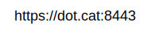
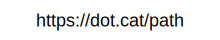

# Documentation

## class DomUrl

This class implements specification for the Browser URL API

Currently, this is the only way to use the parser. In the future, more 
convenient APIs might be added. Feel free to propose your ideas in the Discussions!

## Constructors

### `DomUrl(string input, string? baseUrl = null)`

Creates a new DomUrl object by parsing the input string

You can pass an optional **baseUrl** parameter to parse relative URLs:

```csharp
new DomUrl("search?q=cat", "https://google.com")
```

Throws `InvalidUrlException` when **input** or **baseUrl** is not a valid URL. 
You can use its fields **Message** and **UrlError** to get more information for debugging purposes

### `DomUrl(string input, DomUrl baseUrl)`

It's the same as above but allows you to use an already parsed URL as a base

You should consider it when you are parsing multiple URLs with the same base

## Methods

### `bool TryCreate(string input, out DomUrl? result)`

Allows you to parse the URL without having to catch an exception in case it's invalid.
By default, it returns `false` when the URL is invalid, and the `result` parameter will be `null`.

This is useful for handling invalid user input
since you don't need to break your code flow with a try-catch statement.
Additionally, it is useful for code hot paths, 
as the library does not have to allocate an instance of an exception class,
which reduces Garbage Collector pressure.

### 

```csharp
if (!DomUrl.TryCreate("http://example.com", out var url))
    return "Oopsie, you've passed an invalid URL!";

/* do something with url object */
```

### `bool TryCreate(string input, string? baseUrl, out DomUrl? result)`

The same as above but allows you to pass a base URL

### `bool TryCreate(string input, DomUrl baseUrl, out DomUrl? result)`

The same as above but allows you to use an already parsed URL as a base

You should consider it when you are parsing multiple URLs with the same base

### `string ToString()`

Returns the complete URL string. It's the same as the `Href` property

## Properties

All properties return an empty string (`""`) when the respective part is not present in the input URL

### `Protocol`


Returns the protocol (scheme) of this URL<br/>
It <b>always</b> ends with `:`

[MDN](https://developer.mozilla.org/en-US/docs/Web/API/URL/protocol)｜[Standard](https://url.spec.whatwg.org/#dom-url-protocol)

### `Username`


Returns the username of this URL<br/>
When the username is not present in the input URL, the returned value will be an empty string

[MDN](https://developer.mozilla.org/en-US/docs/Web/API/URL/username)｜[Standard](https://url.spec.whatwg.org/#dom-url-username)

### `Password`


Returns the password of this URL<br/>
When the password is not present in the input URL, the returned value will be an empty string

[MDN](https://developer.mozilla.org/en-US/docs/Web/API/URL/password)｜[Standard](https://url.spec.whatwg.org/#dom-url-password)

### `Host`


Returns the host of this URL. It **includes** the port<br/>
For some protocols, when the specified port is the default one, it will not be included. [Read more](#The-default-port-quirk)

[MDN](https://developer.mozilla.org/en-US/docs/Web/API/URL/host)｜[Standard](https://url.spec.whatwg.org/#dom-url-host)

### `Hostname`


Returns the hostname of this URL

[MDN](https://developer.mozilla.org/en-US/docs/Web/API/URL/hostname)｜[Standard](https://url.spec.whatwg.org/#dom-url-hostname)

### `Port`


Returns the port of this URL<br/>
For some protocols, when the specified port is the default one, the returned value will be an empty string. [Read more](#The-default-port-quirk)

[MDN](https://developer.mozilla.org/en-US/docs/Web/API/URL/port)｜[Standard](https://url.spec.whatwg.org/#dom-url-port)

### `Pathname`




Returns the path of this URL <br/> 
If trailing slash is present in the input, it will be included

[MDN](https://developer.mozilla.org/en-US/docs/Web/API/URL/pathname)｜[Standard](https://url.spec.whatwg.org/#dom-url-pathname)

### `Search`


Returns the search (query) of this URL

If a query is present in the input the string will start with the prefix `?`<br/>
Otherwise, it will be an empty string

[MDN](https://developer.mozilla.org/en-US/docs/Web/API/URL/search)｜[Standard](https://url.spec.whatwg.org/#dom-url-search)

### `Hash`



Returns the hash (fragment) of this URL

If a hash is present in the input, the string will start with the prefix `#`<br/>
Otherwise, it will be an empty string

[MDN](https://developer.mozilla.org/en-US/docs/Web/API/URL/hash)｜[Standard](https://url.spec.whatwg.org/#dom-url-hash)


### `Href`


Returns a serialized representation of this URL. It will contain all the parts mentioned above

This property can be used for URL normalization:
for example, you can validate a URL from user input and then serialize it to the most widely compatible representation:

```csharp
> new DomUrl("http://example.com/././foo").Href 
↳ "http://example.com/foo" 

> new DomUrl("http://你好.cn").Href
↳ "http://xn--6qq79v.cn/"

> new DomUrl("http:\\\\www.google.com\\foo").Href
↳ "http://www.google.com/foo"
```

[MDN](https://developer.mozilla.org/en-US/docs/Web/API/URL/href)｜[Standard](https://url.spec.whatwg.org/#dom-url-href)

### `Origin`

Returns the origin of this URL

Origin is a part of [HTML specification](https://html.spec.whatwg.org/multipage/browsers.html#origin) and most likely you won't need it. 
<br/>Note that the specification doesn't define how to serialize the origin when the scheme is **file**, and in this library, it was decided to return the string `"null"`

[MDN](https://developer.mozilla.org/en-US/docs/Web/API/URL/origin)｜[Standard](https://url.spec.whatwg.org/#dom-url-origin)


## Notes

### The default port quirk

This library ignores the port, even when explicitly specified in the input string, under the following conditions:

| Protocol | Port |
|----------|------|
| `http`   | 80   |
| `https`  | 443  |
| `ws`     | 80   |
| `wss`    | 443  |

For example, if the input string is `http://example.com:80`, the `Port` property will return an empty string
